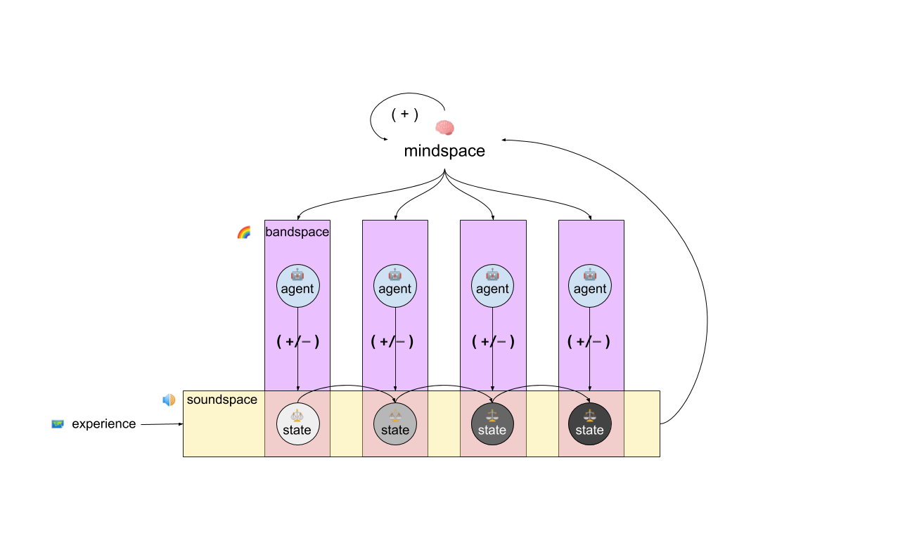
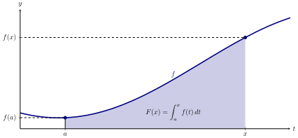
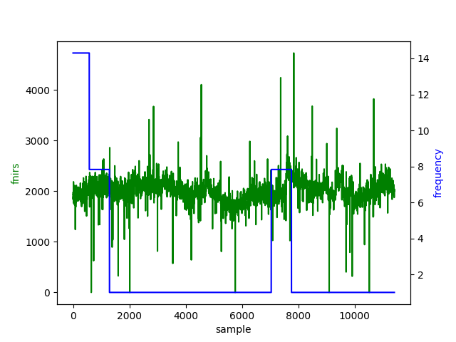

# Architecture
Developing the abstract mental model for how to think about this project, can create a better foundation in the active experimentation and development.

## Abstraction: Agent Composed (Multi-Tiered)

The abstraction for which was chosen is meant to mimic a constrained version of how the reverse of fourier transform works. Rather than deconstructing to unique frequencies, we are systematically composing layers of sounds.

<p align="center">
  
</p>

During this process, the subtle agent guidance by variance based on neurofeedback measurement helps to create more plasticity in the way the brain can 'accepts' tone and sound via constraints. 

<p align="center">
  
</p>

The guided sound 'waves' amount to a layered sound the user will listen to based on relative agent reward response.

## Abstraction: Single Player (Path based)

In the single trajectory, the agent only acts on the tuning of a single band. The variation of frequency of the band dictates the 3rd binaural sound perceived.

```
frequency hz ranges

~delta = 1;     // 0.5 - 2. deep sleep, unsconsciousness
~theta = 5.5;   // 4 - 7. Meditative, drowsy, sleeping. Memory, spatial learning
~mu = 9;        // 9 - 11. associated with voluntary movement
~alpha = 10;    // 7.5 - 12.5. Relaxed states of mind
~beta1 = 14;    // 12.5 - 16. Normal waking consciousness
~beta2 = 18;    // 16.5 - 20.
~beta3 = 24;    // 20.5 - 28
~gamma = 35;    // 32 - 100. Visual awareness, transcendental mental states
```
This process of creating difference between 2 frequency functions, can be abstractly modelled after the process of integration. By creating difference in perception, one is able to reason in higher dimensions from a place of increased complexity.

<p align="center">
  
</p>

The experience can be graphed by recording hemodynamic response to frequency in hz, with subtle changes to neuro response with subtle noticeable differences.

<p align="center">
  
</p>

## Abstraction: Multi-player

TODO: Something with p2p networking & fft covariance frequency matchmaking. Find your complimentary resonance.

# Architecture Sub-system

<p align="center">
  
</p>

# Setup Goals
Ease of extensibility for any stream of EEG, fNIRS, or haptic data stream that might be used as an input.
Portable to carry with you.
Offline-first to protect private data.
Computational possibility (e.g. networking, intelligence, etc.).
Customizable to steersman aesthetic.
Accessible to hackers.

## Input Convolution
5x5

## Randomization
Action space has a 50% randomization for state selection.

## Agent Type
Policy Network, more on this [here](https://towardsdatascience.com/policy-networks-vs-value-networks-in-reinforcement-learning-da2776056ad2?gi=3f17354ded7d)

## Reward Function
TODO: Needs help tuning.
