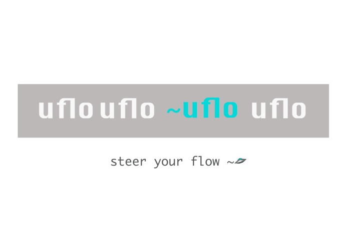
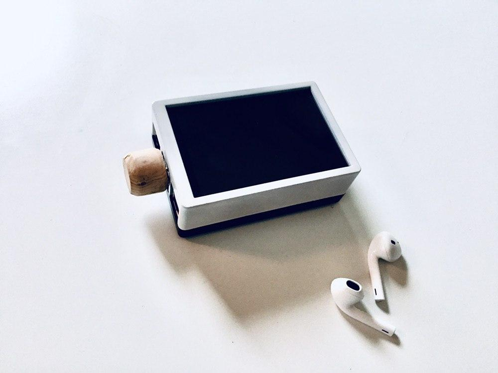

  

---

# ~uflo
A binaural beat toolkit for collective consciousness used by the modern practicing [Steersman](https://en.wikipedia.org/wiki/Guild_Navigator) in times of [Kairos](https://en.wikipedia.org/wiki/Kairos).

**Steersman**: Derived from [Dune](https://en.wikipedia.org/wiki/Dune_(franchise)), Steersman, or, Navigators, are fictional humanoids able to use a limited form of [prescience](https://www.merriam-webster.com/dictionary/prescience) to safely navigate interstellar space.

**Kairos**: Kairos refers to the opportune time and/or place — that is, the right or appropriate time to say or do the right or appropriate thing.

**Goal**: Personal infrastructure for open mindful computing. Augment ones practice to uncover new states through an objective medium of measurement like [fNIRS](https://en.wikipedia.org/wiki/Functional_near-infrared_spectroscopy). How? Subtle signal assistance.

An excercise tool for those seeking a [free mind](https://www.youtube.com/watch?v=YThxh8BQKZE) using accesible audio signals.

## How to Run

There are 2 approaches to running the software: 1) desktop ✔️, or 2) Rasberry Pi ✔️

Both require [SuperCollider](https://supercollider.github.io/download.html) to be installed.
Note: In order to use the python-supercollider, the liblo library is required for the underlying OSC communications.

OS X: brew install liblo
Ubuntu: apt-get install liblo7 liblo-dev

### 1. Device Setup: Desktop with/without bci (3 terminals)

a. Terminal 1 : Run Audio Server 
* `$ sudo sclang sounds/source.scd` # loads all SynthDefs, you should hear a musical tone if audio is connected

b. Terminal 2: (not needed if running uflo without a bci, skip to #3)
* connect bci device
* run one of the socket [streamers](/streamer) to connect to a bci SDK, e.g. [blueberry](https://github.com/blueberryxtech/blueberry-js-sdk)

c. Terminal 3 : Run uflo
* `$ git clone https://github.com/moskalyk/uflo.git` # clone repo
* `$ cd uflo/synth/` # go into the synth folder
* `$ virtualenv venv && source venv/source/activate` # Create a virtual environment for your python packages
* `$ pip3 install -r requirements.txt` # install dependencies
* `$ python3 index.py --mode binaural` # run and choose mode
* be present

### 2. Device Setup: Rasberry Pi (currently, no bci)
* install Rasbian on micro SD
* install Supercollider on pi
* install [Cython](https://cython.readthedocs.io/en/latest/src/quickstart/install.html)
* install [LCD Screen Show](https://github.com/goodtft/LCD-show)
* it's easiest to create [desktop icons](https://www.geeks3d.com/20191122/how-to-create-a-shortcut-on-the-raspbian-desktop/) for easy start scripts 
* follow install instructions from 1.c
* install [pytorch on pi from wheel package](https://medium.com/secure-and-private-ai-writing-challenge/a-step-by-step-guide-to-installing-pytorch-in-raspberry-pi-a1491bb80531) (note: must be done within virtualenv)
* be present

## Inspiration

**Device Design** : Somewhere between an e-ink kindle & touch phone, like a pokedex but for our world - to capture thoughts, privately, on a walk. Producing a single copy of memories to share once connected, if need be with a level of pseudo-anonymity. Ultimately, a hardware extension that augments the embodied, not so much as a void / hole for attention capture. Enabling agents of reflexivity.

**Abstract Simplicity** : While many are focusing on complex synthesis of sounds, this project aims to systematically use unitized audio signals as a digital catalyst for rotational perspective shifts when meditating, going for a walk, or, as an overlay to any experience.

**Binaural Beats** : An auditory illusion by way of different frequencies in either ear to simulate a new sound perceived which is not presented. Cognitive advantages for such states can improve frequency detection i.e. perceptual learning. By tuning ones perceptual learning capability in real time, one can increase their subjective experience of novelty when connecting with nature, learning a new skill, unlearning habits, or boosting mindfulness.

**Cybernetics** : The scientific study of control and communication in the animal and the machine. 

**Quantum Cognition** : The tool is meant to simulate a [Hadamard gate](https://www.quantum-inspire.com/kbase/hadamard/) used in quantum computing, but for ones mind. Hadamard gates create a superposition point between 2 basis states (e.g. frequencies) whereby one is able to expand the possibilities of environmental navigation through optimal perceptual learning and action. The concept: in an increasingly connected mind, practice holding competing trajectories of thought to aid in empathetic decision making.

  

## Philosophy (a WIP)
* Open sourcing the concept was the first intention, as consciousness tools should be open and available.
* Engaging in open conversation around building for human cognition enhancements.
* Documented process for optimal community building around experimental explorers and other audio / livecoding ecosystem.
* Seed more people in calm computing states. The greater the collective synchronous, the more mindful we can be for designing systems that work.
* WIP / Submit PR

### Possible Modes of Play
* *Single*: Following single signal trajectory tuned via reinforcement agent to neurofeedback (or manual via tuning knob)
* *Composed*: Adding sound dimensions for optimal composition supported via scynth audio server
* *Multiplayer*: p2p connected soundscape for group / global meditative / practice experience

## Technologies Used
* [Pytorch](https://pytorch.org/)
* [Supercollider / scynth](https://supercollider.github.io/)
* [Blueberryx brain-computer-interface](https://www.blueberryx.com/)
* [Rasberry pi](https://www.raspberrypi.org/)
* [Socket.io](https://socket.io/)

**Signal-Oriented Programming**: Signal programming is used in the same sense as dataflow programming, whereby a signal is meant to represent a synchronous flow of data interrupted by an operating system. 

  

When a signal is sent, the operating system (brain) interrupts the target process' normal flow of execution to deliver the signal. 

Hypothesis: The more ones mind is out of sync / less responsive to constructs, the greater the use of this therapy as it's simple, non-intrusive, but requires techniques of meditation.

Excercised interruption requires a reestablishment of normal time based protocols for synchrony assistance in cultural adaptation. More on this [here](https://medium.com/colloquium/is-it-ever-natural-to-be-late-5aed5ff11169)

### Hardware Design Examples
Integrated clean natural feel. Lab, spaceship, beach, or forest.

  
  

See [ARCHITECTURE.md]() for abstraction decisions.

### Hardware List
* [Case](https://www.amazon.ca/gp/product/B07BSG7V3J/)
* [Rasberry Pi](https://www.amazon.ca/Raspberry-MS-004-00000024-Pi-Model-Motherboard/dp/B01LPLPBS8/)
* [Battery](https://www.amazon.ca/gp/product/B07BSG7V3J/)
* [MicroSD](https://www.amazon.ca/Sandisk-SDSQUAR-032G-GN6MA-Ultra-Micro-Adapter/dp/B073JWXGNT/)
* [USB Microphone](https://www.amazon.ca/SunFounder-Microphone-Raspberry-Recognition-Software/dp/B01KLRBHGM)
* Mechanical Knob (note: currently this is a shaved cork and does nothing, I had to get creative in quarantine).

### Development Status
What began as a concept at an [EthGlobal hackathon](https://devpost.com/software/yourflow), winning a prize for trustless computation of neurofeedback, seeded the concept for further exploration in the design process.

Currently under active development.

### TODOS
- [ ] easy start script
- [ ] multiplayer mode
- [ ] refactor to load different flow paths

### Other Relevant Research / Tools
- [Blueberry](https://www.kickstarter.com/projects/jdchibuk/smart-glasses-that-help-you-relax-and-perform)
- [Neurosity](https://github.com/neurosity/)
- [Binaural Effectiveness](https://github.com/neurohazardous/binauralBeats)
- etc.

A special thanks to [John David Chibuk](https://github.com/chibuk) and the [Blueberry](https://github.com/blueberryxtech) team for active support during experimentation process.

### FAQ

#### Why not use a mobile app?
* Possible Soundscape generated from the audio server [scsynth](https://supercollider.github.io/) can be live manipulated via neurofeedback.
* Building process / customization is important for community of hackers.
* Can run a Virtual Machine - for something like [Urbit](https://urbit.org/)
* Binuaural beats require seperate isolated control of left vs. right ear frequency.
* Positive constraint of not being connected to telecommunications, limited to BLE.
* Possible easy loading of WASM as linear-signal transforms (future).
* Sounds are generated on device from saved text file. E.g. kilobytes vs. megabytes per experience.
* Possibility to set up [mesh networking software](https://github.com/tomeshnet/prototype-cjdns-pi) for steersmen to seed adoption of p2p internet as relayers in a city.
* Possibility for local sound file updates via over the air [radio waves communication](https://en.wikipedia.org/wiki/Radio_wave) using AX.25 packet radio protocol connected via USB e.g. [chattervox](https://www.npmjs.com/package/chattervox)

#### Sounds like digital drugs?
> “This Snow Crash thing--is it a virus, a drug, or a religion?” 
Juanita shrugs. 
“What's the difference?”
― Neal Stephenson, Snow Crash

#### Isn't this the beginning of cyborgism?
Maybe. Just a pragmatic push for another view to take a societal measurement.

> The making of a synthetic brain requires now little more than time and labour .... Such a machine might be used in the distant future ... to explore regions of intellectual subtlety and complexity at present beyond the human powers .... How will it end? I suggest that the simplest way to find out is to make the thing and see.
― Ross Ashby, "Design for a Brain" (1948, 382–83)

#### What can it feel like?
art, technology, both?

  

